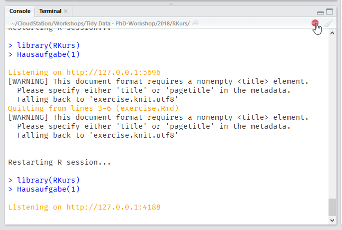

# RKurs

Kursbegleitende Übungsaufgaben für den PhD-Workshop [R Statistics and Tidy Data](http://elearning.uke.uni-hamburg.de/m/course/view.php?id=308).

## Installation

Zum Installieren der Übungsaufgaben folgenden Code ausführen (das Paket *devtools* muss installiert sein):

```r
library(devtools)
devtools::install_github("strengejacke/RKurs")
```

Danach ist das Paket installiert.

## Aufgaben starten

Um eine Übungsaufgabe auszuführen, einfach das Paket _RKurs_ laden die Funktion `Hausaufgabe()` mit der Aufgabennummer aufrufen:

```r
library(RKurs)
Hausaufgabe(1)
```

Das Paket wird mit jeder Kurssitzung erweitert, d.h. die Übungsaufgaben werden sukzessive hinzugefügt.

## Aufgaben beenden

Die Übungsaufgaben rufen einen Webbrowser auf, in dem die Aufgaben durchgeführt werden können. Wenn man die Aufgaben beendet (in dem man den Browser schließt), ist der Prozess in R noch aktiv (siehe rotes Stop-Schild in RStudio). Zum Beenden dann einfach auf das rote Symbol klicken.


